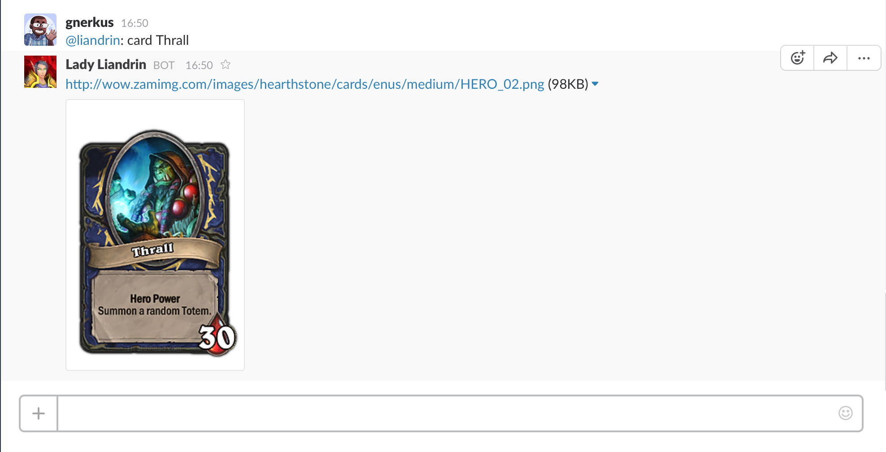

# Liandrin Bot

A repository of information on the [Hearthstone](http://us.battle.net/hearthstone/en/) game within your Slack organization.

At the moment, the bot can only respond to requests to view the images of cards. An improved search and additional features are being added.

## Running Locally

Make sure you have [Node.js](http://nodejs.org/) and the [Heroku Toolbelt](https://toolbelt.heroku.com/) installed.

```sh
git clone git@github.com:gnerkus/liandrinbot.git # or clone your own fork
cd liandrinbot
npm install
npm start
```

Your app should now be running on [localhost:1337](http://localhost:1337/).

## Deploying to Heroku

```
heroku apps:create <app-name>
git push heroku master
```

You'll need to obtain an API token from Slack by [creating a bot user](https://api.slack.com/bot-users). Once you've obtained the token, you can set it as an environment variable on the liandrinbot server:

```shell
heroku config:set LIANDRIN_SLACK_API_TOKEN=<slack-token>
```

Alternatively, you can deploy your own copy of the app using the web-based flow:

[](https://heroku.com/deploy)

## Usage
### View the image for a card
```
@liandrin card Thrall
```

